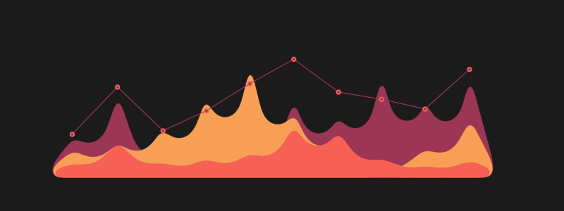

 

  

 

    

-------- 

## 🖥️ Notable Research and Projects
    
### Deep Learning
| Research Topic | Modules & Technologies | Engagements |
|--|--|--|
| 
[Automated Detection of Cardiac Arrhythmia based on a Hybrid CNN-LSTM Network](https://github.com/shahriar-rahman/Automated-Detection-of-Cardiac-Arrhythmia) 
 | 
              
 |   
  
 |
| 
 [Precise Diagnosis of Parkinson's Disease using an Ensemble of Neural Networks](https://github.com/shahriar-rahman/Precise-Diagnosis-of-Parksinsons-Disease)  
 | 
                  
 |   
    
  |
| 
 [Prediction of Solar Radiation using Artificial Neural Networks](https://github.com/shahriar-rahman/Prediction-of-Solar-Radiation)  
 | 
              
 |   
   
 |

### Machine Learning
| Research Topic | Modules & Technologies | Engagements |
|--|--|--|
| 
[A Comparative Analysis of Amazon Book Ratings using Collaborative Filtering](https://github.com/shahriar-rahman/A-Comparative-Analysis-of-Amazon-Book-Ratings-using-Collaborative-Filtering) 
 | 
           
 | 
    
 |
| 
[Netflix Customer Retention using Gaussian Process Regression](https://github.com/shahriar-rahman/Netflix-Customer-Retention-using-GPR) 
 | 
                 
 | 
    
 |
| 
[Prediction of Compressive Strength using Multi-Layered Perceptron](https://github.com/shahriar-rahman/Prediction-of-Compressive-Strength-using-Multi-Layered-Perceptron) 
 | 
       
 | 
    
 |
| 
[An Evaluation Application of Sentiment Analysis for Twitter](https://github.com/shahriar-rahman/Twitter-Sentiment-Analysis) 
 | 
         
 | 
    
 |

### Data Analytics
| Research Topic | Modules & Technologies | Engagements |
|--|--|--|
| 
 [Exploratory Analysis of Netflix Userbase Data](https://github.com/shahriar-rahman/Exploratory-Analysis-of-Netflix-Userbase) 
 | 
           
 | 
    
 |
| 
 [Exploratory Data Analysis on Amazon Books Reviews](https://github.com/shahriar-rahman/EDA-Amazon-Books-Reviews) 
 | 
                
 | 
     
 |
| 
 [Exploratory Data Analysis on Civil Engineering Dataset for Concrete Strength](https://github.com/shahriar-rahman/EDA-Civil-Engineering-Concrete-Dataset) 
 | 
            
 | 
     
 |
| 
 [Exploratory Data Analysis on Smart Home System](https://github.com/shahriar-rahman/EDA-Smart-Home-System) 
 | 
               
 | 
   
 |

### Web Scraping
| Research Topic | Modules & Technologies | Engagements |
|--|--|--|
| 
 [Web Scraping Audible using Selenium Webdriver](https://github.com/shahriar-rahman/Web-Scraping-Audible-Using-Selenium-Webdriver)  
 | 
         
 | 
    
 |
| 
 [Amazon User Product Scraping](https://github.com/shahriar-rahman/Amazon-Product-Scraping)  
 | 
      
 | 
       |
| 
 [Scraping Crypto Stocks in Finance](https://github.com/shahriar-rahman/Scraping-Crypto-Stocks-in-Finance)  
 | 
      
 | 
      
 |
| 
 [Yahoo Sports Tracker using Beautiful Soup](https://github.com/shahriar-rahman/Yahoo-Sports-News-Tracker-using-Beautiful-Soup/tree/main)  
 | 
        
 | 
      
 |
| 
 [Scraping Amazon Daily Offers using Selenium Webdriver](https://github.com/shahriar-rahman/Amazon-Today-Using-Selenium-Webdriver)   
 | 
        
 | 
      
  |
| 
 [Extraction of Unlisted Zone Shares data using Scrapy](https://github.com/shahriar-rahman/Unlisted-Zone-Shares-Data-Extraction)   
 | 
         
 | 
      
 | 

### Database & Web Development
| Research Topic | Modules & Technologies | Engagements |
|--|--|--|
| 
 [Travel Agency System](https://github.com/shahriar-rahman/Travel-Agency-System)  
 | 
           
 | 
     
 |

### Bots & Algorithms
| Research Topic | Modules & Technologies | Engagements |
|--|--|--|
| 
 [AI War Games: KlaraBot ](https://github.com/shahriar-rahman/AI-War-Games)  
 | 
       
 | 
       
 |
| 
 [Project January: Desktop Assistant ](https://github.com/shahriar-rahman/January-Desktop-Assistant)  
 | 
               
 | 
     
 |

### Miscellaneous
| Research Topic | Modules & Technologies | Engagements |
|--|--|--|
|  
 [CLIPS Programming based on Family Relationship Decision Trees](https://github.com/shahriar-rahman/Clips-Programming-Decision-Tree-Family)  
 | 
      
 | 
    
|
|  
  [CLIPS Programming based on Cannibals and Missionaries Problem](https://github.com/shahriar-rahman/CLIPS-Programming-Missionaries-Cannibals-Problem)  
 | 
      
 | 
    
|
|  
  [Scraping Quotes using Beautiful Soup Library](https://github.com/shahriar-rahman/Scraping-Quotes-using-Beautiful-Soup)  
 | 
        
 | 
     
 |
|  
  [Selenium Automated Script for Cookie Clicker](https://github.com/shahriar-rahman/Selenium-Automated-Script-for-Cookie-Clicker)  
 | 
     
 | 
    
 |
|  
  [Socket Server Admin-User for Rock-Paper-Scissor](https://github.com/shahriar-rahman/Socket-Server-Rock-Paper-Scissor)  
 | 
       
 | 
    
|
|  
  [Structuring Data Graphs](https://github.com/shahriar-rahman/Data-Structures-Graph)  
 | 
       
 | 
    
 |
|  
  [Contact Management System](https://github.com/shahriar-rahman/Contact-Management-System)  
 | 
     
 |    |

    

### Github Stats
 
 
 
 

 

